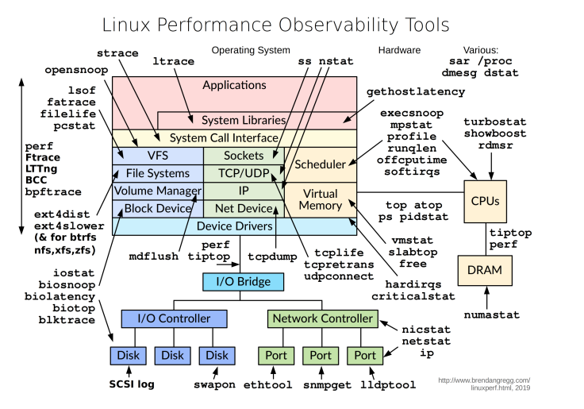
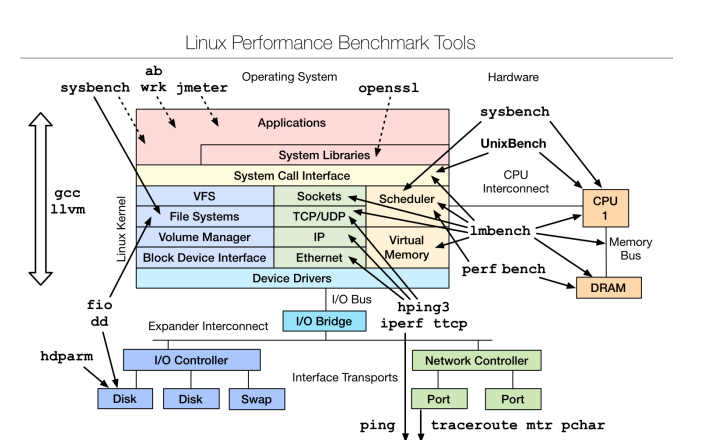
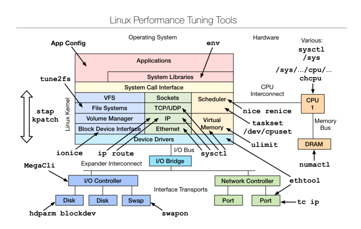

## 0 课程重点
1. Linux基础命令和工具
2. CPU性能监控
3. 内存性能监控
4. 文件IO性能监控
5. 网络IO性能监控

### 监控命令
常用的命令：
- free
- ping
- vmstat（Virtual Meomory Statistics，虚拟内存统计）
- iostat（用于报告中央处理器（CPU）统计信息和整个系统、适配器、tty设备、磁盘和CD-ROM的输入/输出统计信息）
- dstat（显示了CPU使用情况，磁盘IO情况，网络发包情况和换页情况，输出是彩色的，可读性较强，相对于vmstat和iostat的输入更加详细且较为直观）
- pidstat（主要用于监控全部或指定进程占用系统资源的情况，如CPU、内存、设备IO、任务切换、线程等）
- top（命令的汇总区域显示了五个方面的系统性能信息：负载、进程状态、CPU使用率、内存使用、交换分区）
- iotop（Linux进程实时监控工具，界面风格类似top命令）
- htop（是Linux系统中的一个互动的进程查看器，一个文本模式的应用程序（在控制台或者X终端中），需要ncurses）
- mpstat（Report processors related statistics，报告CPU的统计信息）
- netstat（用于显示与IP、TCP、UDP和ICMP协议相关的统计数据，一般用于检验本机各端口的网络连接情况）
- ps（显示当前进程的状态）
- strace（Trace system calls and signals，跟踪程序执行过程中产生的系统调用及接收到的信号，帮助分析程序或命令执行中遇到的异常情况）
- ltrace（A library call tracer，跟踪进程调用库函数的情况）
- uptime（能够打印系统总共运行了多长时间和系统的平均负载，uptime命令最后输出的三个数字的含义分别是1分钟、5分钟、15分钟内系统的平均负荷）
- lsof（list open files，是一个列出当前系统打开文件的工具）
- perf（是Linux kernel自带的系统性能优化工具。优势在于与Linux Kernel的紧密结合，它可以最先应用到加入Kernel的new feature，用于查看热点函数，查看cashe miss的比率，从而帮助开发者来优化程序性能）
- tcpdump
- sar
- blktrace

### 测试

sysbench是一个模块化、跨平台、多线程基准测试工具，可用于以下性能测试：
1. CPU性能
2. 磁盘IO性能
3. 调度程序性能
4. 内存分配及传输速度
5.P OSIX线程性能
6. 数据库性能（OLTP基准测试）


Linux CPU使用率主要是从以下几个维度进行统计：

1. %usr：普通进程在用户模下下执行的时间；
2. %sys：进程在内核模式下的执行时间；
3. %nice：被提高优先级的进程在用户模式下的执行时间；
4. %idle：空闲时间。
5. %iowait：等待I/O完成的时间。
6. %irp：处理硬中断请求花费的时间。
7. %soft：处理软中断请求花费的时间。
8. %steal：是衡量虚拟机CPU的指标，是指分配给本虚拟机的时间片被同一宿主机别的虚拟机占用，一般%steal值较高时，说明宿主机的资源使用已达到瓶颈；

一般情况下，CPU大部分的时间片都是消耗在用户态和内核态上。


sys和user间的比例是相互影响的:
1. %sys比例高意味着被测服务频繁的进行用户态和系统态之间的切换，会带来一定的CPU开销，这样分配处理业务的时间片就会较少，造成系统性能的下降。
2. 对于IO密集型系统，无论是网络IO还是磁盘IO，一般都会产生大量的中断，从而导致%sys相对升高，其中磁盘IO密集型系统，对磁盘的读写需要占用大量的CPU，会导致%iowait的值一定比例的升高，所以当出
现%iowait较高时，需排查是否存在大量的不合理的日志操作，或者频繁的数据载入等情况



### 优化



## 1 Linux基础命令和工具

### 1.1 grep搜索字符

指定文件查找，查找login关键字
```shell
grep  login  ImUser.cpp
```

反向查找，查找文件中，不包含 CImUser 的行。
```shell
grep -v CImUser ImUser.cpp
```
找出文件中包含 login的行，并打印出行号
```shell
grep  -n login  ImUser.cpp
```

找出文件中包含 login的行，打印出行号，并显示前后3行
```shell
grep -C 3 -n login  ImUser.cpp
```

找出文件中包含 login的行，打印出行号，并显示前后3行，并忽略大小写
```shell
grep -C 3 -i -n login  ImUser.cpp
```

### 1.2 find查找文件

通过文件名查找文件的所在位置，文件名查找支持模糊匹配
find  [指定查找目录]  [查找规则]  [查找完后执行的action]

常用的操作：
```shell
find . -name FILE_NAME
find . -iname FILE_NAME 忽略文件名称大小写
find /etc -maxdepth 1 -name passwd     ##查找/etc/下名称中带有passwd的文件，查找一层
find /mnt -size 20K       ##查找/mnt文件大小近似20k的文件
find /mnt -size +20K      ##查找/mnt文件大小大于20k的文件
find /mnt -size -20K      ##查找/mnt文件大小小于20k的文件
find /etc -maxdepth 2 -mindepth 2 -name .conf  ##查找/etc/下名称中带有.conf的文件，且只查
找第二层
find /mnt -type d         ##按type查找/mnt中目录
find /mnt -type f         ##按type查找/mnt中文件
find /mnt -cmin 10        ##查找/mnt中十分钟左右修改的
find /mnt -cmin +10       ##查找/mnt中十分钟以上修改的
find /mnt -cmin -10       ##查找/mnt中十分钟以内修改的
find /mnt -ctime 10       ##查找/mnt中十天左右修改的
find /mnt -ctime +10      ##查找/mnt中十天以上修改的
find /mnt -ctime -10      ##查找/mnt中十天以内修改的
```

### 1.3 ls显示文件

-t 可以查看最新修改的时间
   -l 每行显示一个条目
 -h 可以结合显示文件的GB，MB等(human)；
   -R 递归显示
   -n 显示组id和gid

ls -lt  按最新修改的时间排序，新修改的在前面显示。
ls -ltR 按最新修改的时间排序，新修改的在前面显示，并显示子目录的文件信息
ls -lh 以单位显示文件大小

### 1.4 wc命令

wc命令用于计算字数。  利用wc指令我们可以计算文件的Byte数、字数、或是列数，若不指定文件名
称、或是所给予的文件名为"-"，则wc指令会从标准输入设备读取数据。
语法
wc [-clw][--help][--version][文件...]
参数：
-c或--bytes或--chars 只显示Bytes数。
-l或--lines 只显示行数。
-w或--words 只显示字数。
--help 在线帮助。
--version 显示版本信息。

```shell
wc testfile           # testfile文件的统计信息
7 92 607 testfile       # testfile文件的行数为7、单词数92、字节数607
```
### 1.5 uptime机器启动时间+负载


查看机器的启动时间、登录用户、平均负载等情况，通常用于在线上应急或者技术攻关中，确定操作系统的重启时间。
```shell
[root@ubuntusrc]# uptime
 13:01:52 up 46 days, 22:03,  4 users,  load average: 0.13, 0.08, 0.05
```

从上面的输出可以看到如下信息:
- 当前时间： 13:01:52
- 系统已经运行的时间：43天22小时3分钟。
- 前在线用户：4个用户，是总连接数量，不是不同用户数量（开一个终端连接就算一个用户）。
- 系统平均负载:0.13 , 0.08, 0.05，为最近1分钟、5分钟、15分钟的系统负载情况。

系统的平均负载是指在特定的时间间隔内队列中运行的平均进程数。如果一个进程满足以条件，它就会位于运行队列中
- 它没有在等待I/O操作的结果。
- 它没有主动进入等待状态(也就是没有调用’wait'相关的系统API ) 
- 没有被停止(例如:等待终止)


如果每个CPU内核的当前活动进程数不大于3的话，那么系统的性能还算可以支持。

如果每个CPU内核的任务数大于5，那么这台机器的性能有严重问题。

如果你的linux主机是1个双核CPU的话，当Load Average 为6的时候说明机器已经被充分使用了


负载说明（现针对单核情况，不是单核时则乘以核数）：
- load<1：没有等待
- load==1：系统已无额外的资源跑更多的进程了
- load>1：进程都堵着等待资源

注意：
- load < 0.7时：系统很闲，要考虑多部署一些服务
- 0.7 < load < 1时：系统状态不错
- load == 1时：系统马上要处理不多来了，赶紧找一下原因
- load > 5时：系统已经非常繁忙了


不同load值说明的问题　　　　　
1. 1分钟 load >5，5分钟 load <3，15分钟 load <1 ：短期内繁忙，中长期空闲，初步判断是一个抖动或者是拥塞前兆
2. 1分钟 load >5，5分钟 load >3，15分钟 load <1 ：短期内繁忙，中期内紧张，很可能是一个拥塞的开始
3. 1分钟 load >5，5分钟 load >5，15分钟 load >5 : 短中长期都繁忙，系统正在拥塞
4. 1分钟 load <1，5分钟Load>3，15分钟 load >5 : 短期内空闲，中长期繁忙，不用紧张，系统拥塞正在好转

补充：

查看cpu信息：`cat /proc/cpuinfo`

直接获取cpu核数：`grep 'model name' /proc/cpuinfo | wc -l`


### 1.6 ulimit用户资源

Linux系统对每个登录的用户都限制其最大进程数和打开的最大文件句柄数。为了提高性能，可以根据硬件资源的具体情况设置各个用户的最大进程数和打开的最大文件句柄数。可以用ulimit -a来显示当前的各种系统对用户使用资源的限制:


```shell
[root@ubuntu~]# ulimit -a
core file size          (blocks, -c) 0
data seg size           (kbytes, -d) unlimited
scheduling priority             (-e) 0
file size               (blocks, -f) unlimited
pending signals                 (-i) 7269
max locked memory       (kbytes, -l) 64
max memory size         (kbytes, -m) unlimited
open files                      (-n) 100001
pipe size            (512 bytes, -p) 8
POSIX message queues     (bytes, -q) 819200
real-time priority              (-r) 0
stack size              (kbytes, -s) 8192
cpu time               (seconds, -t) unlimited
max user processes              (-u) 65535
virtual memory          (kbytes, -v) unlimited
file locks                      (-x) unlimited

```

设置用户的最大进程数：
`ulimit -u 1024`
设置用户可以打开的最大文件句柄数：
`ulimit -n 65530`

### 1.7 curl http

由于当前的线上服务较多地使用了RESTful风格的API，所以集成测试就需要进行HTTP调用，查看返回的
结果是否符合预期，curl命令当然是首选的测试方法。
使用方式：
```shell
curl -i "http://www.sina.com" # 打印请求响应头信息
curl -I "http://www.sina.com" # 仅返回http头
curl -v "http://www.sina.com" # 打印更多的调试信息
curl -verbose "http://www.sina.com" # 打印更多的调试信息
curl -d 'abc=def' "http://www.sina.com" # 使用post方法提交http请求
curl -sw '%{http_code}' "http://www.sina.com" # 打印http响应码
```
### 1.8 scp远程拷贝


### 1.9 dos2unix和unix2dos

用于转换Windows和UNIX的换行符，通常在Windows系统h开发的脚本和配置，UNIX系统下都需要转换。

使用方式：
```shell
dos2unix test.txt
unix2dos test.txt

#转换整个目录
find . -type f -exec dos2unix {} \;
find ./ -type f 此命令是显示当前目录下所有的文件

```

### 2.0 sed    

命令格式1：`sed 's/原字符串/新字符串/' 文件`

命令格式2：`sed 's/原字符串/新字符串/g' 文件

这两种命令格式的区别在于是否有个“g”。
- 没有“g”表示只替换第一个匹配到的字符串，
- 有“g”表示替换所

有能匹配到的字符串，“g”可以认为是“global”（全局的）的缩写，没有“全局的”结尾就不要替换全部。

sed命令是用来批量修改文本内容的，比如批量替换配置中的某个ip。

sed命令在处理时，会先读取一行，把当前处理的行存储在临时缓冲区中，处理完缓冲区中的内容后，打印到屏幕上。然后再读入下一行，执行下一个循环。不断的重复，直到文件末尾。

### 1.11 awk 命令 


## 2 CPU性能监控


### 2.1 平均负载

#### 平均负载基础

平均负载是指单位时间内，系统处于**可运行状态和不可中断状态**的平均进程数，也就是平均活跃进程数，它和 CPU 使用率并没有直接关系。
- **可运行状态的进程**，是指正在使用 CPU 或者正在等待 CPU 的进程，也就是我们常用 ps 命令看到的，处于 R 状态（Running 或 Runnable）的进程。
- **不可中断状态的进程** 则是正处于内核态关键流程中的进程，并且这些流程是不可打断的，比如最常见的是等待硬件设备的 I/O 响应（），也就是我们在 ps 命令中看到的 D 状态（UninterruptibleSleep，也称为 Disk Sleep）的进程。

平均负载其实就是平均活跃进程数。平均活跃进程数，直观上的理解就是单位时间内的活跃进程数。


如何分析平均负载，比如当平均负载为 2 时，意味着什么呢？
- 在只有 2 个 CPU 的系统上，意味着所有的 CPU 都刚好被完全占用。
- 在 4 个 CPU 的系统上，意味着 CPU 有 50% 的空闲。
- 而在只有 1 个 CPU 的系统中，则意味着有一半的进程竞争不到 CPU。

负载说明（现针对单核情况，不是单核时则乘以核数）：
- load<1：没有等待
- load==1：系统已无额外的资源跑更多的进程了
- load>1：进程都堵着等待资源


意：
- load < 0.7时：系统很闲，要考虑多部署一些服务
- 0.7 < load < 1时：系统状态不错
- load == 1时：系统马上要处理不多来了，赶紧找一下原因
- load > 5时：系统已经非常繁忙了


#### 平均负载与 CPU 使用率


**平均负载**是指单位时间内，处于可运行状态和不可中断状态的进程数。所以，它不仅包括了正在使用CPU 的进程，还包括等待 CPU 和等待 I/O 的进程。
**CPU 使用率**，是单位时间内 CPU 繁忙情况的统计，跟平均负载并不一定完全对应。比如：
- CPU 密集型进程，使用大量 CPU 会导致平均负载升高，此时这两者是一致的；
- I/O 密集型进程，等待 I/O 也会导致平均负载升高，但 CPU 使用率不一定很高；
- 大量等待 CPU 的进程调度也会导致平均负载升高，此时的 CPU 使用率也会比较高。


#### 监测命令

安装对应的命令：`apt install stress sysstat`
其中sysstat 包括了mpstat 和pidstat 。


压测命令：stress ，一个 Linux 系统压力测试工具，这里我们用作异常进程模拟平均负载升高的场景。

监测命令：mpstat 是一个常用的多核 CPU 性能分析工具，用来实时查看每个 CPU 的性能指标，以及所有 CPU 的平均指标。

pidstat 是一个常用的进程性能分析工具，用来实时查看进程的 CPU、内存、I/O 以及上下文切换等性能指标。

#### ps进程信息

ps用一于显示系统内的所有进程。-l或l 采用详细的格式来显示进程状况。

常用方式：`ps -elf` 和`ps -ef`

输出：
```shell
yxc@yxc-MS-7B89:~/code/lingsheng/2.1cpp_advance$ ps -elf
F S UID        PID  PPID  C PRI  NI ADDR SZ WCHAN  STIME TTY          TIME CMD
4 S root         1     0  0  80   0 - 56540 -      Jul24 ?        00:04:11 /sbin/init splash
1 S root         2     0  0  80   0 -     0 -      Jul24 ?        00:00:00 [kthreadd]
1 I root         3     2  0  60 -20 -     0 -      Jul24 ?        00:00:00 [rcu_gp]
1 I root         4     2  0  60 -20 -     0 -      Jul24 ?        00:00:00 [rcu_par_gp]
1 I root         6     2  0  60 -20 -     0 -      Jul24 ?        00:00:00 [kworker/0:0H-kb]
1 I root         8     2  0  60 -20 -     0 -      Jul24 ?        00:00:00 [mm_percpu_wq]
1 S root         9     2  0  80   0 -     0 -      Jul24 ?        00:00:16 [ksoftirqd/0]
1 I root        10     2  0  80   0 -     0 -      Jul24 ?        00:22:23 [rcu_sched]
1 S root        11     2  0 -40   - -     0 -      Jul24 ?        00:00:02 [migration/0]
5 S root        12     2  0   9   - -     0 -      Jul24 ?        00:00:00 [idle_inject/0]
1 S root        14     2  0  80   0 -     0 -      Jul24 ?        00:00:00 [cpuhp/0]
5 S root        15     2  0  80   0 -     0 -      Jul24 ?        00:00:00 [cpuhp/1]
5 S root        16     2  0   9   - -     0 -      Jul24 ?        00:00:00 [idle_inject/1]
1 S root        17     2  0 -40   - -     0 -      Jul24 ?        00:00:02 [migration/1]
1 S root        18     2  0  80   0 -     0 -      Jul24 ?        00:00:11 [ksoftirqd/1]
1 I root        20     2  0  60 -20 -     0 -      Jul24 ?        00:00:00 [kworker/1:0H-kb]
5 S root        21     2  0  80   0 -     0 -      Jul24 ?        00:00:00 [cpuhp/2]
5 S root        22     2  0   9   - -     0 -      Jul24 ?        00:00:00 [idle_inject/2]
1 S root        23     2  0 -40   - -     0 -      Jul24 ?        00:00:02 [migration/2]
```

##### 常用命令

(1) 检测是否有活动进程：
```shell
sudo ps -ef |grep "nginx: master process" |grep -v grep
```
(2) 检测有几个同样的活动进程

```shell
sudo ps -ef |grep "nginx: master process" |grep -v grep |wc -l
```


#### top进程cpu内存信息

top命令用于查看活动进程的CPU和内存信息，能够实时显示系统中各个进程的资源占用情况，可以按照CPU、内存的使用情况和执行时间对进程进行排序。


从输出可以看到整体的CPU占用率、CPU负载，以及进程占用CPU和内存等资源的情况。

我们可以用以下所示的top命令的快捷键对输出的显示信息进行转换。
- t：切换报示进程和CPU状态信息。
- n：切换显示内存信息。
- r：重新设置一个进程的优先级。系统提示用户输人需要改变的进程PID及需要设置的进程优先级，然后输入个正数值使优先级降低，反之则可以使该进程拥有更高的优先级，即是在原有基础上进行相加，默认优先级的值是100
- k：终止一个进程，系统将提示用户输入需要终止的进程PID o
- s：改变刷新的时间间隔。
- u：查看指定用户的进程。
#### mpstat
此命令用于实时监控系统CPU的一些统计信息，这些信息存放在/proc/stat文件中，在多核CPU系统里，不但能查看所有CPU的平均使用信息，还能查看某个特定CPU的信息。

##### 安装即使用方式

使用方式：`mpstat [-P {cpu|ALL}] [internal [count]]`

需要安装：`sudo apt install sysstat`

当mpstat不带参数时，输出为从系统启动以来的平均值。

```shell

yxc@yxc-MS-7B89:~/code/lingsheng/2.1cpp_advance$ mpstat -P ALL
Linux 5.4.0-150-generic (yxc-MS-7B89)   08/19/2023      _x86_64_        (16 CPU)

02:56:55 PM  CPU    %usr   %nice    %sys %iowait    %irq   %soft  %steal  %guest  %gnice   %idle
02:56:55 PM  all    0.12    0.00    0.19    0.00    0.00    0.02    0.00    0.00    0.00   99.67
02:56:55 PM    0    0.16    0.00    0.20    0.00    0.00    0.14    0.00    0.00    0.00   99.49
02:56:55 PM    1    0.12    0.00    0.20    0.00    0.00    0.04    0.00    0.00    0.00   99.63
02:56:55 PM    2    0.16    0.00    0.20    0.00    0.00    0.01    0.00    0.00    0.00   99.62
02:56:55 PM    3    0.12    0.00    0.22    0.00    0.00    0.00    0.00    0.00    0.00   99.65
02:56:55 PM    4    0.09    0.00    0.17    0.00    0.00    0.01    0.00    0.00    0.00   99.73
02:56:55 PM    5    0.09    0.00    0.17    0.00    0.00    0.00    0.00    0.00    0.00   99.74
02:56:55 PM    6    0.09    0.00    0.17    0.00    0.00    0.00    0.00    0.00    0.00   99.74
02:56:55 PM    7    0.09    0.00    0.17    0.00    0.00    0.00    0.00    0.00    0.00   99.74
02:56:55 PM    8    0.11    0.00    0.21    0.00    0.00    0.00    0.00    0.00    0.00   99.68
02:56:55 PM    9    0.11    0.00    0.21    0.00    0.00    0.00    0.00    0.00    0.00   99.68
02:56:55 PM   10    0.11    0.00    0.21    0.00    0.00    0.00    0.00    0.00    0.00   99.68
02:56:55 PM   11    0.26    0.00    0.24    0.00    0.00    0.12    0.00    0.00    0.00   99.39
02:56:55 PM   12    0.09    0.00    0.17    0.00    0.00    0.00    0.00    0.00    0.00   99.74
02:56:55 PM   13    0.09    0.00    0.17    0.00    0.00    0.00    0.00    0.00    0.00   99.74
02:56:55 PM   14    0.09    0.00    0.17    0.00    0.00    0.00    0.00    0.00    0.00   99.74
02:56:55 PM   15    0.09    0.00    0.17    0.00    0.00    0.00    0.00    0.00    0.00   99.74
yxc@yxc-MS-7B89:~/code/lingsheng/2.1cpp_advance$
```


##### 输出参数含义

当没有参数时，mpstat则显示系统启动以后所有信息的平均值。有interval时，第一行的信息自系统启动以来的平均信息。从第二行开始，输出为前一个interval时间段的平均信息。 输出各参数含义：


| 参数          | 释义                                               | 从/proc/stat获得 数据  |
|-------------|--------------------------------------------------|-------------------|
| CPU         | 处理器ID                                            |                   |
| %usr        | 在internal时间段里，用户态的CPU时间（%），不包含 nice值为负进程         | usr/total*100     |
| %nice       | 在internal时间段里，nice值为负进程的CPU时间（%）                 | nice/total*100    |
| %sys        | 在internal时间段里，核心时间（%）                            | system/total*100  |
| %iowait     | 在internal时间段里，硬盘IO等待时间（%）                        | iowait/total*100  |
| %irq        | 在internal时间段里，硬中断时间（%）                           | irq/total*100     |
| %soft       | 在internal时间段里，软中断时间（%）                           | softirq/total*100 |
| %steal      | 显示虚拟机管理器在服务另一个虚拟处理器时虚拟CPU处在非自愿等待下花费时间的百分比        | steal/total*100   |
| %guest      | 显示运行虚拟处理器时CPU花费时间的百分比                            | guest/total*100   |
| %gnice      |                                                  | gnice/total*100   |
| %idle       | 在internal时间段里，CPU除去等待磁盘IO操作外的因为任何原因而空闲的时间闲置时间（%） | idle/total*100    |


#### pidstat

pidstat用于监控全部或指定的进程占用系统资源的情况，包括CPU、内存、磁盘I/O、程切换、线程数等数据。


- -u：表示查看cpu相关的性能指标
- -w：表示查看上下文切换情况，要想查看每个进程的详细情况，要加上-w
- -t：查看线程相关的信息，默认是进程的;常与-w结合使用(cpu的上下文切换包括进程的切换、线程的切换、中断的切换)
- -d：展示磁盘 I/O 统计数据
- -p：指明进程号


### 场景1：CPU 密集型进程

1. 模拟一个CPU 使用率 100% 的场景
